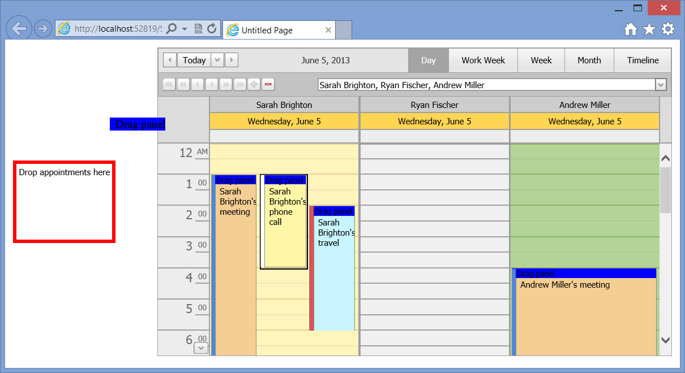

<!-- default badges list -->

[](https://supportcenter.devexpress.com/ticket/details/E4708)
[](https://docs.devexpress.com/GeneralInformation/403183)
<!-- default badges end -->

# Scheduler for ASP.NET Web Forms - How to drop an appointment from Scheduler to an external control
<!-- run online -->
**[[Run Online]](https://codecentral.devexpress.com/e4708/)**
<!-- run online end -->

This example demonstrates how to drag and drop appointment info from [ASPxScheduler](https://docs.devexpress.com/AspNet/DevExpress.Web.ASPxScheduler.ASPxScheduler) to an outside area. 



## Implementation Details

The built-in drag-and-drop functionality within the **ASPxScheduler** can conflict with a custom implementation. To resolve the conflict, add a "Drag panel" `div` element to an appointment template and disable the built-in drag-and-drop functionality in its client-side `onmousedown` event handler.

```aspx
<div class="draggable" style="background: blue;" onmousedown="DragPanelHold();">
```

```js
function DragPanelHold() {
    // disable built-in dragging logic
    setTimeout('scheduler.mouseHandler.SwitchToDefaultState();', 0);
}
```

Attach the [Draggable](https://jqueryui.com/draggable/) jQuery interaction to the "Drag panel" so that it can be dragged. Attach the [Droppable](https://jqueryui.com/droppable/) jQuery interaction to a `div` element with the [ASPxListBox](https://docs.devexpress.com/AspNet/DevExpress.Web.ASPxListBox) inside. It serves as a drop target. The **appointmentId** value is passed via a hidden field.

```aspx
<div class="droppable">
	<dx:ASPxListBox ID="ASPxListBox1" runat="server"  ClientInstanceName="listBox">
	    <Items>
	        <dx:ListEditItem Text="Drop appointments here" Value="Drop appointments here" />
	    </Items>
	</dx:ASPxListBox>
</div>
```

```js
function InitalizejQuery(s, e) {
    $('.draggable').draggable({ helper: 'clone', appendTo: 'body', zIndex: 100 });
    $('.droppable').droppable({
            activeClass: "dropTargetActive",
            hoverClass: "dropTargetHover",
            
            drop: function (ev, ui) {
                var appointmentId = $(ui.draggable).find("input[type='hidden']").val();
                listBox.AddItem(appointmentId);
                // Additional logic goes here...
            }
        }
    );
}
```

Call the `InitalizejQuery` method in the client-side [ASPxGlobalEvents.ControlsInitialized](https://docs.devexpress.com/AspNet/js-ASPxClientGlobalEvents.ControlsInitialized) and [ASPxGlobalEvents.EndCallback](https://docs.devexpress.com/AspNet/js-ASPxClientGlobalEvents.EndCallback) event handlers.

```aspx
<dx:ASPxGlobalEvents ID="ASPxGlobalEvents1" runat="server">
	<ClientSideEvents ControlsInitialized="InitalizejQuery" EndCallback="InitalizejQuery" />
</dx:ASPxGlobalEvents>
```

## Files to Review

* [CustomEvents.cs](./CS/App_Code/CustomEvents.cs) (VB: [CustomEvents.vb](./VB/App_Code/CustomEvents.vb))
* [Helpers.cs](./CS/App_Code/Helpers.cs) (VB: [Helpers.vb](./VB/App_Code/Helpers.vb))
* [CustomVerticalAppointmentTemplate.ascx](./CS/CustomForms/CustomVerticalAppointmentTemplate.ascx) (VB: [CustomVerticalAppointmentTemplate.ascx](./VB/CustomForms/CustomVerticalAppointmentTemplate.ascx))
* [CustomVerticalAppointmentTemplate.ascx.cs](./CS/CustomForms/CustomVerticalAppointmentTemplate.ascx.cs) (VB: [CustomVerticalAppointmentTemplate.ascx.vb](./VB/CustomForms/CustomVerticalAppointmentTemplate.ascx.vb))
* [Default.aspx](./CS/Default.aspx) (VB: [Default.aspx](./VB/Default.aspx))
* [Default.aspx.cs](./CS/Default.aspx.cs) (VB: [Default.aspx.vb](./VB/Default.aspx.vb))

## Documentation

* [How to: Customize Appointment Appearance via Templates](https://docs.devexpress.com/AspNet/4220/components/scheduler/examples/customization/custom-form-and-custom-fields/how-to-customize-appointment-appearance-via-templates)

## More Examples

* [Text Box for ASP.NET Web Forms - How to apply the jQuery AutoComplete plugin to an editor](https://github.com/DevExpress-Examples/asp-net-web-forms-textbox-apply-jquery-autocomplete-plugin)
* [How to drag a row from ASPxGridView to ASPxScheduler](https://github.com/DevExpress-Examples/how-to-drag-a-row-from-aspxgridview-to-aspxscheduler-e4292)
* [How to drag-and-drop an appointment from an external control](https://github.com/DevExpress-Examples/how-to-drop-an-appointment-from-an-external-control-onto-an-aspxscheduler-e4746)
